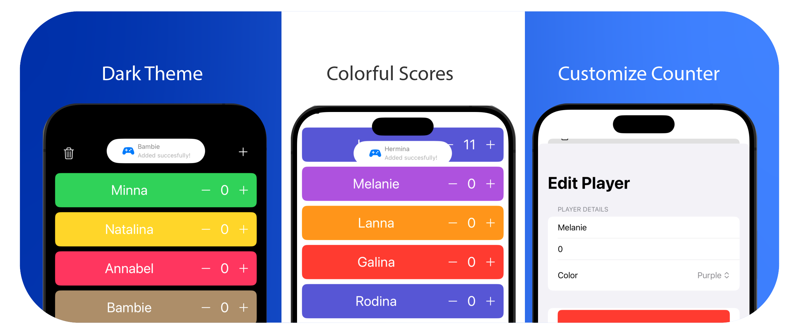

# Score counter app for iOS

An easy to use app on iOS to keep scores for all sort of games.

- Keep track of scores for any game or activity
- Customizable design to fit your needs
- Add and keep scores with a simple tap
- Choose the amount by which scores are increased or decreased
- Includes a virtual dice roll function
- Perfect for big numbers and any number of players
- Dark theme for low-light conditions
- Completely free to use, with **NO Ads**

## How to install

Currently I dont have an apple developper account, but there is a solution you can use [AltStore classic](https://altstore.io) and add my source to download the app `https://gist.githubusercontent.com/aminekun90/7cc4885b56e0b0f1212db1ecf9c24369/raw/77d7ed4504db5a41b29770c65f452e1f6e5a05c8/altstore.json`

If like the app and you want it in the official apple app store you can donate I'll make it happen [Paypal me](https://www.paypal.com/paypalme/aminebouzahar)

## Want to contribute or have any suggestions or questions?

Open an issue or pull request [here on github](https://github.com/aminekun90/ScoreCounter)
