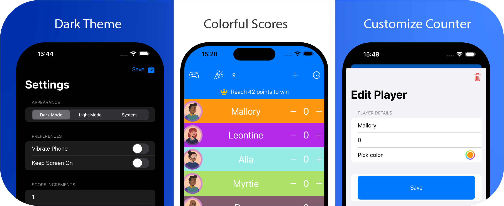

#  Score counter app for iOS

An easy to use app on iOS to keep scores for all sort of games.

- Keep track of scores for any game or activity
- Customizable design to fit your needs
- Add and keep scores with a simple tap
- Choose the amount by which scores are increased or decreased
- Includes a virtual dice roll function
- Perfect for big numbers and any number of players
- Dark theme for low-light conditions
- Completely free to use, with **NO Ads**

## How to install

Currently I dont have an apple developper, but there is a solution you can use [AltStore classic](https://altstore.io) and add my source to download the app [AmineDev Source](https://github.com/aminekun90/ScoreCounter/releases/download/1.0/app.json)

If you want it in the official app store you can donate I'll make it happen [Paypal me](https://www.paypal.com/paypalme/aminebouzahar)
